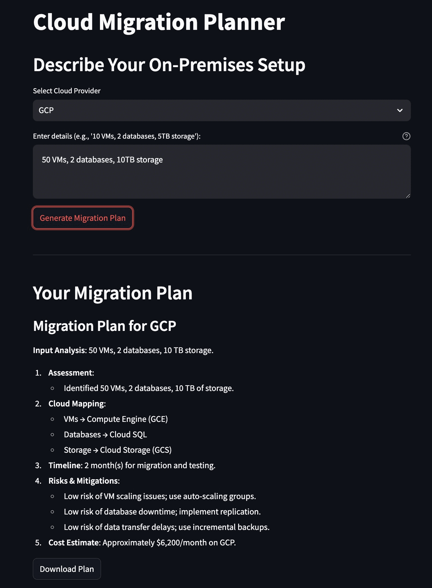

# Cloud Migration Planner

[](https://opensource.org/licenses/MIT) A Streamlit-based web application to generate dynamic cloud migration plans from on-premises infrastructure to cloud providers (AWS, Azure, GCP). This tool parses user input (e.g., VMs, databases, storage) and provides a tailored migration plan with timeline, risks, mitigations, and cost estimates.

## Features

* **Dynamic Input Parsing**: Enter your on-premises setup (e.g., "50 VMs, 2 databases, 10TB storage") and get a customized plan.
* **Cloud Provider Selection**: Choose between AWS, Azure, or GCP with provider-specific service mappings.
* **Migration Plan Output**:
    * Assessment of current infrastructure.
    * Cloud service mappings (e.g., Compute Engine for GCP, EC2 for AWS).
    * Estimated timeline based on resource scale.
    * Risks and mitigation strategies.
    * Rough cost estimate.
* **Downloadable Plans**: Export your migration plan as a Markdown file.
* **Extensible**: Placeholder for integrating generative AI models like Gemini for enhanced plan generation.

## Demo



## Installation

### Prerequisites

* Python 3.8+
* Git

### Steps

1.  **Clone the Repository**:
    ```bash
    git clone [https://github.com/your-username/cloud-migration-planner.git](https://www.google.com/search?q=https://github.com/your-username/cloud-migration-planner.git)
    cd cloud-migration-planner
    ```
    *(Replace `your-username` with your actual GitHub username)*

2.  **Install Dependencies**:
    ```bash
    pip install -r requirements.txt
    ```
    *If no `requirements.txt` exists yet, install manually:*
    ```bash
    pip install streamlit requests
    ```

3.  **Run the App**:
    ```bash
    streamlit run migration_app.py
    ```
    Open your browser to `http://localhost:8501`.

## Usage

1.  **Launch the App**: Run the command `streamlit run migration_app.py`.
2.  **Select Cloud Provider**: Choose AWS, Azure, or GCP from the dropdown menu.
3.  **Enter Infrastructure Details**: Input your on-premises setup in the text area (e.g., "20 VMs, 3 databases, 100GB storage").
4.  **Generate Plan**: Click the "Generate Migration Plan" button to see the output.
5.  **Download**: Use the "Download Plan" button to save the generated plan as a `.md` file.

## Example

### Input

```text
50 VMs, 2 databases, 10TB storage
